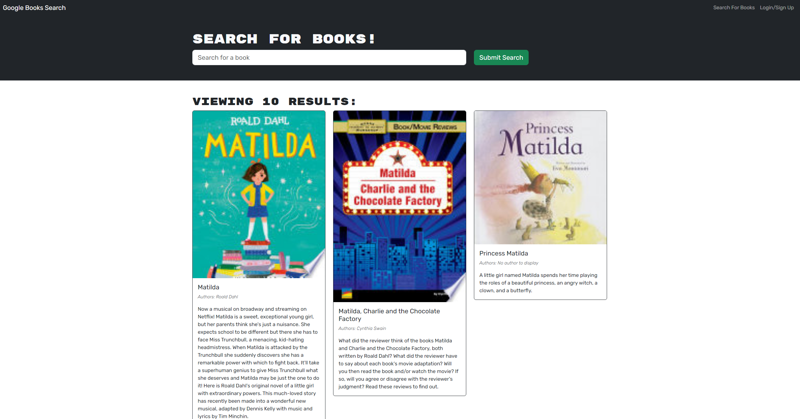
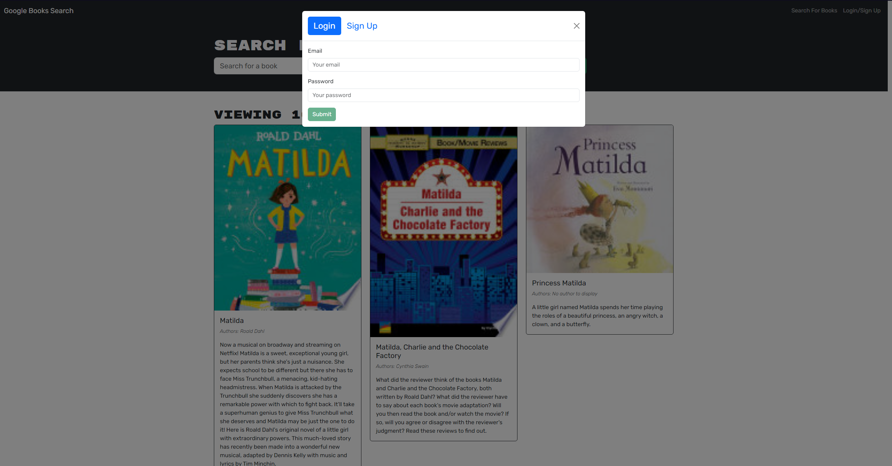
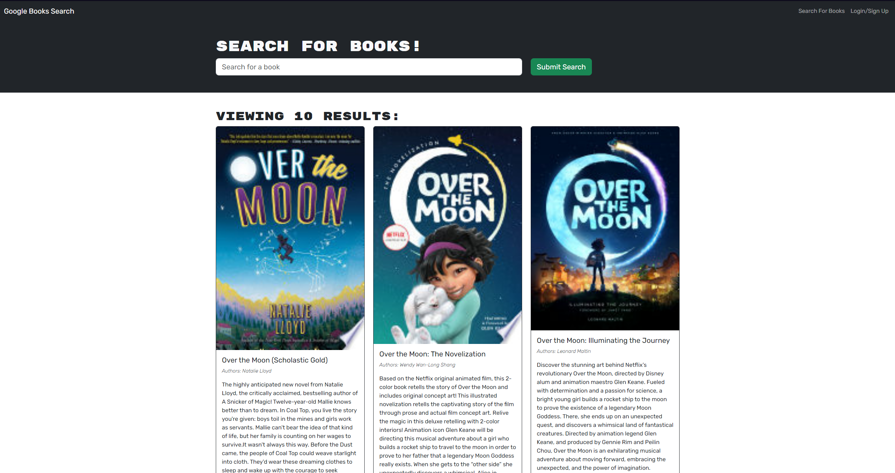

<!-- Improved compatibility of back to top link: See: https://github.com/othneildrew/Best-README-Template/pull/73 -->
<a name="readme-top"></a>
<div align="center">

[![Contributors][contributors-shield]][contributors-url]
[![Forks][forks-shield]][forks-url]
[![Stargazers][stars-shield]][stars-url]
[![Issues][issues-shield]][issues-url]
[![MIT License][license-shield]][license-url]

</div>


<!-- PROJECT LOGO -->
<br />
<div align="center">
  <a href="https://github.com/Nalipas/Book-Search-Engine">
    
  </a>

<h3 align="center">Book Search Engine</h3>

  <p align="center">
    A full stack application using Google Books Search API.
    <br />
    <a href="https://github.com/Nalipas/Book-Search-Engine"><strong>Explore the docs »</strong></a>
    <br />
    <br />
    <a href="https://github.com/Nalipas/Book-Search-Engine">View Demo</a>
    ·
    <a href="https://github.com/Nalipas/Book-Search-Engine/issues/new?labels=bug&template=bug-report---.md">Report Bug</a>
    ·
    <a href="https://github.com/Nalipas/Book-Search-Engine/issues/new?labels=enhancement&template=feature-request---.md">Request Feature</a>
  </p>
</div>


<!-- TABLE OF CONTENTS -->
<details>
  <summary>Table of Contents</summary>
  <ol>
    <li>
      <a href="#about-the-project">About The Project</a>
      <ul>
        <li><a href="#built-with">Built With</a></li>
      </ul>
    </li>
    <li>
      <a href="#getting-started">Getting Started</a>
      <ul>
        <li><a href="#prerequisites">Prerequisites</a></li>
        <li><a href="#installation">Installation</a></li>
      </ul>
    </li>
    <li><a href="#usage">Usage</a></li>
    <li><a href="#contributing">Contributing</a></li>
    <li><a href="#license">License</a></li>
    <li><a href="#contact">Contact</a></li>
    <li><a href="#acknowledgments">Acknowledgments</a></li>
  </ol>
</details>


<!-- ABOUT THE PROJECT -->
## About The Project



The Books Search Engine uses the Google Books Search API to find and display search results of books based on user query.



<p align="right">(<a href="#readme-top">back to top</a>)</p>


### Built With

* [![React][React.js]][React-url]
* [![Vite][Vite.js]][Vite-url]
* [![Express][Express.js]][Express-url]
* [![Graph][GraphQL]][GraphQL-url]
* [![Mongo][MongoDB]][MongoDB-url]


<p align="right">(<a href="#readme-top">back to top</a>)</p>


<!-- GETTING STARTED -->
## Getting Started

This is an example of how to get the project running on your local machine. Alternatively, the application is hosted on Render [https://Book-Search-Engine.onrender.com/](https://Book-Search-Engine.onrender.com/).

### Prerequisites

<a href="https://nodejs.org/en/download/package-manager">Node.js</a> and <a href="https://docs.npmjs.com/downloading-and-installing-node-js-and-npm">Node Package Manager (NPM)</a> are required to download and install the dependencies of this project. Install <a href="https://nodejs.org/en/download/package-manager">Node.js</a>, then run this command in your CLI to install NPM.
* npm
  ```sh
  npm install -g npm
  ```

### Installation

1. Clone the repo to your desired directory.
   ```sh
   git clone git@github.com:Nalipas/Book-Search-Engine.git
   ```
2. Install NPM packages
   ```sh
   npm run install
   ```
3. Seed the database.
    ```sh
    npm run seed
4. Run the application.
    ```sh
    npm run start
<p align="right">(<a href="#readme-top">back to top</a>)</p>


<!-- USAGE EXAMPLES -->
## Usage

The application can be run locally, or in your browser on https://book-search-engine-yin6.onrender.com


<p align="right">(<a href="#readme-top">back to top</a>)</p>


<!-- CONTRIBUTING -->
## Contributing

Contributions are what make the open source community such an amazing place to learn, inspire, and create. Any contributions you make are **greatly appreciated**.

If you have a suggestion that would make this better, please fork the repo and create a pull request. You can also simply open an issue with the tag "enhancement".
Don't forget to give the project a star! Thanks again!

1. Fork the Project
2. Create your Feature Branch (`git checkout -b feature/AmazingFeature`)
3. Commit your Changes (`git commit -m 'Add some AmazingFeature'`)
4. Push to the Branch (`git push origin feature/AmazingFeature`)
5. Open a Pull Request

<p align="right">(<a href="#readme-top">back to top</a>)</p>


<!-- LICENSE -->
## License

Distributed under the MIT License. See `LICENSE.txt` for more information.

<p align="right">(<a href="#readme-top">back to top</a>)</p>


<!-- CONTACT -->
## Contact

Steven Moreno - [@Nalipas](https://github.com/Nalipas) - smoreno2014@gmail.com <br>

Project Link: [https://github.com/Nalipas/Book-Search-Engine](https://github.com/Nalipas/Book-Search-Engine)<br>
Deployed Project: https://book-search-engine-yin6.onrender.com

<p align="right">(<a href="#readme-top">back to top</a>)</p>


<!-- ACKNOWLEDGMENTS -->
## Acknowledgments

* [Mark Carlson](https://github.com/mark-carlson) for instructor support
* [Mariah Wear](https://github.com/mariahw4) for TA support
* [Clarence C]() for TA support

<p align="right">(<a href="#readme-top">back to top</a>)</p>


<!-- MARKDOWN LINKS & IMAGES -->
<!-- https://www.markdownguide.org/basic-syntax/#reference-style-links -->
[contributors-shield]: https://img.shields.io/github/contributors/Nalipas/Book-Search-Engine.svg?style=for-the-badge
[contributors-url]: https://github.com/Nalipas/Book-Search-Engine/graphs/contributors
[forks-shield]: https://img.shields.io/github/forks/Nalipas/Book-Search-Engine.svg?style=for-the-badge
[forks-url]: https://github.com/Nalipas/Book-Search-Engine/network/members
[stars-shield]: https://img.shields.io/github/stars/Nalipas/Book-Search-Engine.svg?style=for-the-badge
[stars-url]: https://github.com/Nalipas/Book-Search-Engine/stargazers
[issues-shield]: https://img.shields.io/github/issues/Nalipas/Book-Search-Engine.svg?style=for-the-badge
[issues-url]: https://github.com/Nalipas/Book-Search-Engine/issues
[license-shield]: https://img.shields.io/github/license/Nalipas/Book-Search-Engine.svg?style=for-the-badge
[license-url]: https://github.com/Nalipas/Book-Search-Engine/blob/master/LICENSE.txt
[product-screenshot]: images/screenshot.png

[React.js]: https://img.shields.io/badge/React-20232A?style=for-the-badge&logo=react&logoColor=61DAFB
[React-url]: https://reactjs.org/
[Vite.js]: https://img.shields.io/badge/Vite-646CFF?style=for-the-badge&logo=Vite&logoColor=white
[Vite-url]: https://vitejs.dev
[Express.js]: https://img.shields.io/badge/express-000000?style=for-the-badge&logo=express&logoColor=white
[Express-url]: https://expressjs.com
[GraphQL]: https://img.shields.io/badge/GraphQL-E434AA?style=for-the-badge&logo=graphql&logoColor=white
[GraphQL-url]: https://graphql.org/
[MongoDB]: https://img.shields.io/badge/-MongoDB-13aa52?style=for-the-badge&logo=mongodb&logoColor=white
[MongoDB-url]: https://www.mongodb.com
